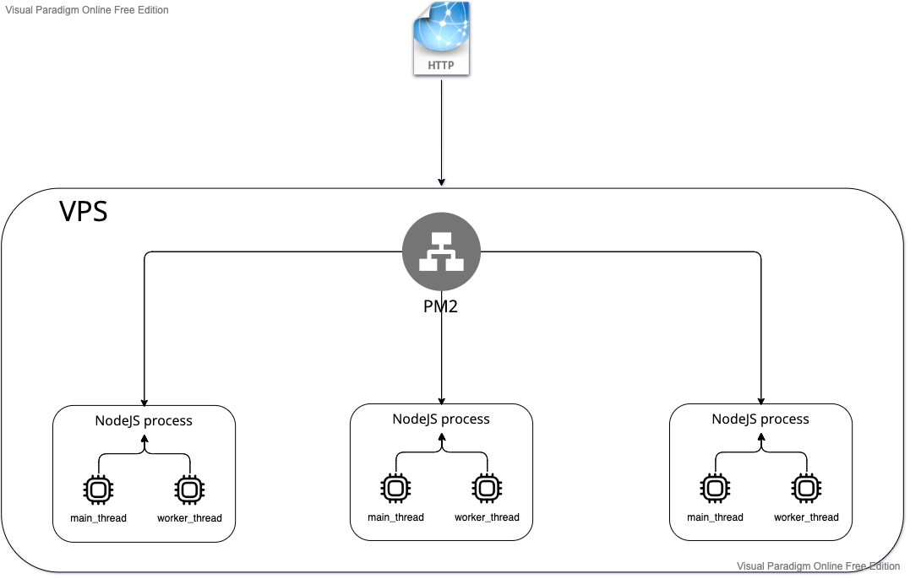

# Dev setup

```
nvm use
```

```
npm install
```

```
npm run dev
```

# Arcitecture

## Worker threads

Running predictions with TensorflowJS is a CPU heavy job, therefor this is done by a seperate worker. Using the worker threads module from Node is reducing response time by ~30-40%.



# PM2

- pm2 plus
  - browser monotoring
